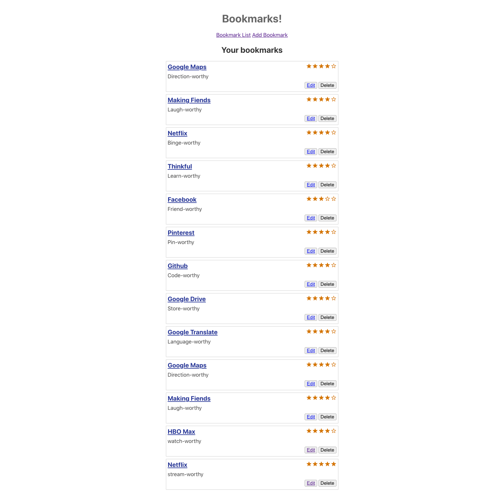

# Bookmarks React Client

- For Thinkful Software Engineering, Flex program: Checkpoint 17
- For this assignment, you'll update the Bookmarks Client (bookmarks-app) that we built as an example project in the React module. 
- 
- This app is for users to save and use bookmarks in their web browsers.
- Makes fetch calls to the server side of the project: bookmarks-server which in turn accesses the bookmarks database
- Being the front end portion of the project, technologies used include:
    - Javascript
    - React
    - React-dom
    - React-router-dom
- Future goals: To my knowledge, the project is complete.
- Screenshots:

## Scripts

Start React for the application `npm start`

Run the tests `npm test`